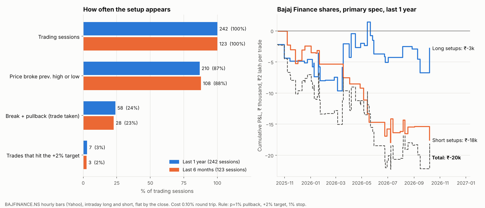

# Bajaj Finance — previous-day high/low break-and-pullback, one year

*Own-account research. Protocol and pass/fail criteria committed before results: `docs/bajajfinance-protocol.md`. Data to 9 Oct 2026.*



## Verdict

**Not supported.** The setup appears often enough (24% of sessions) but the rule loses money on this stock after costs, and it is worse than entering at random times.

## What was tested

The silver rule, unchanged, on the cash-market share `BAJFINANCE.NS` (Yahoo hourly bars, 09:15–15:30 IST, ~7 bars per session), traded intraday long and short and flat by the close. Break = a bar trades beyond the previous session's high (low); pullback = a later bar trades back 1% inside the level; entry at that level; exit at +2% target, −1% stop or the close. Cost 0.10% round trip (STT, stamp, exchange, GST, slippage, ₹40 brokerage on a ~₹2 lakh position). Same-bar ambiguity resolved against the trader. Windows: last 1 year (10 Oct 2025–9 Oct 2026), last 6 months (from 10 Apr 2026), and the prior year as an extra check.

## Opportunities

| | Last 6 months | **Last 1 year** | Prior year |
|---|---|---|---|
| **Trading sessions** | 123 | **242** | 244 |
| Broke previous high | 63 | 116 | 116 |
| Broke previous low | 61 | 124 | 113 |
| Broke either level | 108 (88%) | 210 (87%) | 209 |
| Buy setup (break + 1% pullback) | 15 | 33 (14%) | 28 |
| Sell setup | 15 | 28 (12%) | 35 |
| **Sessions with a setup** | **28 (23%)** | **58 (24%)** | 57 (23%) |
| **Trades** | 30 | **61** | 63 |
| Hit +2% target | 3 | 7 (11%) | 4 |
| Hit −1% stop | 10 | 21 (34%) | 18 |
| Closed at the session end | 17 | 33 (54%) | 41 |

The setup shows up in roughly one session in four — about half as often as on silver (44–46%) — because Bajaj Finance's median daily range is 2.0% against 3.2–3.7% for silver, so a 1% pullback after a break is less common and a 2% target is rarely reached (11% of trades).

## Performance (primary spec, net of 0.10% cost)

| Window | Trades | Win rate | Mean per trade | 95% interval | Profit factor | P&L on ₹2 lakh per trade | Stock buy-and-hold |
|---|---|---|---|---|---|---|---|
| 6M | 30 | 37% | −0.19% | −0.48% to +0.10% | 0.63 | −₹11,400 | +4.0% |
| **1Y** | 61 | 38% | **−0.17%** | −0.38% to +0.05% | 0.66 | **−₹20,400** | −6.3% |
| Prior year | 63 | 46% | −0.07% | −0.27% to +0.12% | 0.82 | −₹9,300 | +37.2% |

**Pre-registered criteria (1Y):** (1) mean > 0 with the interval above 0 — **fail**; (2) beats random-entry timing — **fail** (the rule's −0.17% per trade is worse than random entries at −0.09%; p = 0.96 that random does at least as well); (3) positive without the 3 best trades — **fail** (−0.28%); (4) positive in 6M and the prior year — **fail** (both negative); (5) holds under the conservative same-bar rule — **fail** (optimistic rule gives the same −0.17%).

- **Before costs** the rule is still not positive: −0.07% per trade over the year (interval −0.28% to +0.15%). Costs make a flat rule a losing one.
- **Longs vs shorts (1Y):** longs −0.04% per trade (−0.40% to +0.33%, 33 trades); shorts −0.31% (−0.59% to −0.01%, 28 trades). The short side is the clear loser.
- **No pullback (enter at the break):** −0.16% per trade over 240 trades, interval −0.30% to −0.03% — not better.
- **No stop:** −0.16%. **Cost 0.20%:** −0.27% (interval below zero).
- **Exploratory grid** (pullback 0 / 0.5 / 1% × target 1 / 1.5 / 2 / 3% × stop 0.5 / 1% / none × three windows = 108 cells): **0 of 108 had a positive mean and 0 had an interval above zero.**
- **Resolution check:** on the last 58 sessions (from 20 Jul 2026) with 5- and 15-minute bars: 10 sessions with a setup, 11 trades, −0.12% per trade on both (hourly on the same days: +0.01%); 5-minute bars remove the same-bar ambiguity and give the same result under both rules. 11 trades is far too few to conclude anything.

## Limits

- The hourly first bar covers 09:15–10:15 and the last bar's final 15 minutes are partial, so opening-range moves are coarse; the 60-day 5-minute check agrees in sign.
- Yahoo's intraday bars are not split-adjusted: 16 Jun 2025 (1:2 split and 4:1 bonus) shows a false −80% gap; that session is excluded and returns are chained around it.
- Intraday short selling is allowed only as MIS (flat by the close); I did not test holding overnight.
- One stock, one-year sample, 61 trades. This says the rule has no edge on this stock in this period; it does not rule out an edge on other stocks or with a different rule.

## Reproduce

```
python -m strategy_lab.bajaj_study   # writes strategy_lab/results/bajaj_*.csv
python -m strategy_lab.bajaj_plots
```
