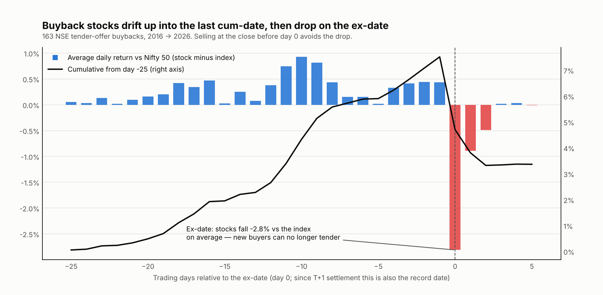
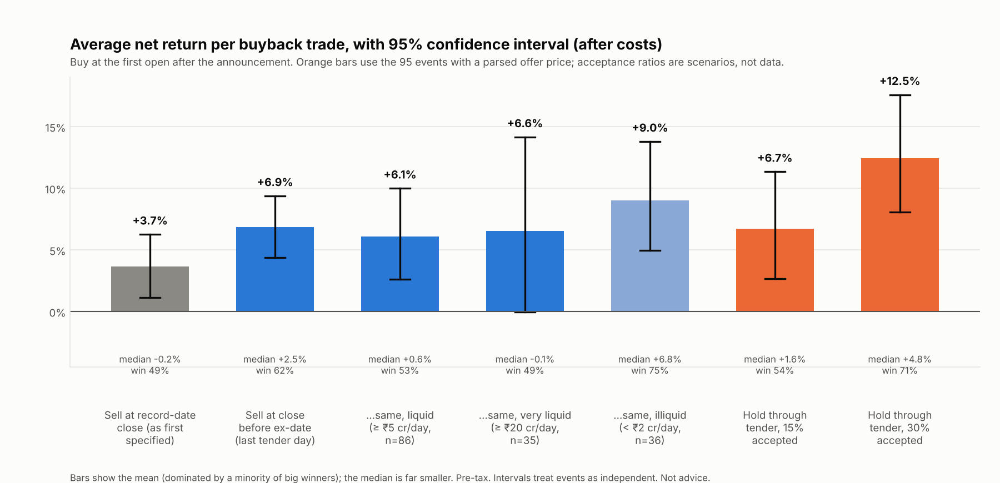

# Buyback Strategy Study — buy at the announcement, sell at the record date

*Run on 8 Oct 2026. Code: [`strategy_lab/buyback_data.py`](../strategy_lab/buyback_data.py) (event collection), [`buyback_study.py`](../strategy_lab/buyback_study.py), [`buyback_plots.py`](../strategy_lab/buyback_plots.py). Not investment advice; back-tests describe the past.*

## 1. Bottom line

**The rule as you stated it — buy when the buyback is announced, sell at the record date or when the price reaches the offer price — shows no edge beyond what these stocks earn in random windows of the same length.** A small tweak to the *exit day* makes a large difference and is supported by the data, but it was found after seeing the first result, and the profit is concentrated in illiquid stocks.

| Question | Answer |
|---|---|
| Rule as specified (sell at record-date close) | Mean **+3.7%** per trade after costs, but **median -0.2%**, 49% winners, and it does **not** beat random same-length windows in the same stocks (p = 0.23). Failed 2 of 4 pre-registered tests (§3) |
| "Sell when price reaches the offer price" | Almost never happens: **4%** of events. The market price stays far below the offer (median offer premium to the pre-announcement price: 30%) until the tender itself. This exit changes nothing |
| Better exit (post-hoc): **sell at the close before the ex-date** (the last day you can still tender) | Mean **+6.9%**, median +2.5%, 62% winners, beats the placebo (p = 0.013), positive in both halves of the sample. The record date is too late: **since T+1 settlement the ex-date *is* the record date**, and in 87% of events the stock falls on it (median -3.1%) |
| Is it tradable? | Mostly in **small, illiquid stocks**. Among the 35 events in stocks trading over ₹20 crore a day the mean is +6.6% but the median is ~0% and the confidence interval touches zero. About 16 events a year, so a side strategy at best |
| Holding through the tender | Positive in scenarios (+6.7% mean at 15% acceptance, +12.5% at 30%) but acceptance ratios are **not in the data** — those are scenarios, not results. Holding past the record date *without* tendering earns nothing (+1.5%, CI includes 0) |



## 2. Data and method

| Item | Detail |
|---|---|
| Events | 198 tender-offer buybacks with a record date, 2016 → Oct 2026, from NSE's public corporate-actions feed (only tender offers have record dates) |
| Announcement date | First *board-approval* filing within 150 days before the record date, found by reading NSE announcement PDFs (`pdftotext`). Found for 84% of events; 163 are tradable after excluding 30 with no announcement date and 5 with no price data |
| Offer price | Parsed from those filings; accepted only if consistent with the stock's market price (0.9×–4× the pre-announcement price). Available for 95 of the 163 |
| Prices | Yahoo Finance adjusted daily data with the same corporate-action cleaning as the main study |
| Entry | **First open at which the announcement is public** (announced before 09:00 → that day's open; otherwise the next trading day). The move before that open is *not* captured — on average +2.1% (median +1.4%) is already in the price |
| Costs | ≈ 0.34% round trip (delivery STT, stamp, exchange, DP charge, 0.05% slippage per side), applied to tender-accepted shares too |
| Benchmarks | Nifty 50 over the same window; a **placebo** of random same-length windows in the same stocks (300 simulations, event windows ±60 days excluded) |
| Median holding | 33 trading days from announcement to record date |

**Two data problems were found and fixed before reporting** (the first version gave +9.6% per trade, a 395% best trade and nonsense offer prices): the offer-price parser was picking up face values (₹4, ₹10) and the announcement date was sometimes an older filing. Remaining weak spots are listed in §6.

## 3. Pre-registered test of the rule as specified (fixed before the first run)

| Criterion | Result | |
|---|---|---|
| S1 mean net return > 0 with a 95% interval excluding 0 | +3.66%, interval +1.16% to +6.32% | **Pass** |
| S2 mean excess over the Nifty 50 > 0 after costs | +1.48% (interval before costs: -0.61% to +3.79%, so not significant) | Pass on the mean only |
| S3 beats the random-window placebo at p ≤ 0.05 | actual +4.0% gross vs placebo +3.3%, **p = 0.23** | **Fail** |
| S4 positive in both 2016–2021 and 2022–2026 | +0.98% (interval -2.88% to +5.32%) and +5.14% | **Fail** (earlier period not distinguishable from zero) |

The mean is lifted by a minority of large winners; the typical trade is flat.

## 4. The exit-day finding (post-hoc — treat with care)

Because the ex-date drop was so regular, I tested selling at the close of the last cum-date instead. This was chosen *after* seeing variant A's result, so its p-value is flattering; the supporting reason is mechanical (only holders at the previous close can tender), not a fitted parameter.

| Variant (net of costs, n = 163) | Mean | 95% interval | Median | Win rate |
|---|---|---|---|---|
| A. Sell at record-date close (specified) | +3.7% | +1.2% to +6.3% | -0.2% | 49% |
| **B. Sell at close before ex-date** | **+6.9%** | +4.5% to +9.5% | +2.5% | 62% |
| C. Sell at offer price if reached, else record-date close | +3.9% | +1.4% to +6.6% | -0.2% | 50% |
| D. Hold 20 days past record date, no tender | +1.5% | -1.3% to +4.6% | -1.1% | 45% |

Variant B: placebo mean +3.0% vs +7.2% actual (p = 0.013); excess over the Nifty 50 after costs +4.7%; 2016–2021 +3.7% (interval +0.5% to +7.1%), 2022–2026 +8.6% (+5.6% to +11.9%).



### Stress tests of variant B

| Cut | n | Mean | Median | Win rate | 95% interval |
|---|---|---|---|---|---|
| All trades | 163 | +6.9% | +2.5% | 62% | +4.5% to +9.5% |
| Turnover ≥ ₹2 cr/day | 127 | +6.3% | +1.9% | 58% | +3.7% to +9.2% |
| Turnover ≥ ₹5 cr/day | 86 | +6.1% | +0.6% | 53% | +2.7% to +10.0% |
| Turnover ≥ ₹20 cr/day | 35 | +6.6% | -0.1% | 49% | **0.0% to +14.2%** |
| Turnover < ₹2 cr/day | 36 | +9.0% | +6.8% | 75% | +5.0% to +13.9% |
| All, costs ×5 | 163 | +5.5% | +1.2% | 58% | +3.1% to +8.1% |
| Turnover ≥ ₹5 cr/day, costs ×5 | 86 | +4.8% | -0.8% | 49% | +1.3% to +8.6% |

* **The edge survives much higher costs** (still +5.5% at 5× costs) but the **median shrinks to about zero in liquid stocks** — you win occasionally and big.
* **It is strongest where it is least tradable**: stocks trading under ₹2 crore a day (9% mean, 75% winners). Position size there is limited by volume, and slippage is probably worse than even 5× my assumption.
* **Year to year it is uneven**: 2018 -2.1%, 2019 -0.1%, 2021 +5.4% (40% winners), versus +9% to +16% in 2023–2025.
* **By offer premium** (95 events): < 10%: +0.3% (n = 10); 10–25%: +3.0% (n = 28); ≥ 25%: +8.1% (n = 57). Bigger offered premiums did better.

## 5. Holding through the tender (scenarios, not results)

Acceptance ratios are not available programmatically, so these use assumed acceptance. The accepted fraction receives the offer price; the rest is sold 20 trading days after the record date (an assumption). Only the 95 events with a parsed offer price.

| Accepted | Mean net | 95% interval | Median | Win rate |
|---|---|---|---|---|
| 15% | +6.7% | +2.7% to +11.5% | +1.6% | 54% |
| 30% | +12.5% | +7.9% to +17.7% | +4.8% | 71% |
| 50% | +20.1% | +14.6% to +26.3% | +10.1% | 96% |
| 100% (not realistic) | +39.3% | +30.9% to +48.8% | +23.8% | 100% |

Recent large buybacks accepted roughly 14–28% of retail shares ([TCS examples](https://www.ipomarket.in/buyback/tcs-buyback-2025-feb)), but small-cap acceptance varies widely. Pre-tax: buyback proceeds were taxed as deemed dividend from Oct 2024 to Mar 2026 and as capital gains again from 1 April 2026 ([Outlook Business](https://www.outlookbusiness.com/budget/union-budget-2026-buyback-payouts-to-be-treated-as-capital-gains-promoters-face-2230-tax)); tender-offer treatment was not confirmed.

## 6. Limitations

1. **Variant B is post-hoc.** Trust its direction (supported by a mechanical reason and a 87% repeat rate) more than its exact size.
2. **Event coverage.** 16% of events had no announcement date found; only 58% have a parsed offer price, so offer-price and tender results rest on 95 events and may be biased toward better-documented buybacks.
3. **Confidence intervals assume independent events**; buybacks cluster in time and market regime, so the true intervals are wider.
4. **Entry timing is conservative.** Many announcements land during market hours; buying intraday could capture part of the +2% already in the price at the next open.
5. **Illiquid names dominate the profit.** Slippage, volume limits and spreads are not modelled beyond a flat 0.05% per side (up to 0.25% in the ×5 test).
6. **Survivorship and data.** Five events had no price history (delisted/renamed); prices are from a free unofficial source; NSE's APIs are unofficial and may change or restrict automated use — check their terms before depending on them.
7. **No tax, no acceptance-ratio data, 20-day residual-sale assumption** in the tender scenarios.
8. About **16 events a year**, so even a perfect rule deploys capital only part of the time.

## 7. What I would do with this

1. **Don't automate the rule as specified.** Selling on the record date gives back about 3% to the ex-date drop.
2. **If you trade buybacks at all, use the exit "sell at the close before the ex-date"** and treat it as a small side strategy, sized modestly (for example 2–3% of capital per event, fewer for illiquid names) and restricted to stocks where you can actually transact.
3. **Treat tender participation as a separate bet** whose payoff depends on the acceptance ratio. Collect acceptance ratios from post-offer filings first, then re-test.
4. **To improve the evidence:** add acceptance ratios and intraday entry prices, repeat on the events found after today (a true out-of-sample set), and cap position size by traded volume in the simulation.
5. As a data feed it is cheap to automate (NSE corporate-actions plus announcements, one daily job), but it deserves paper trading before capital.

## 8. Reproduce

```
python -m strategy_lab.buyback_data    # collects events + announcements + offer prices (~15 min first run, then cached)
python -m strategy_lab.buyback_study   # variants, pre-registered tests, placebo
python -m strategy_lab.buyback_plots   # charts
```
Outputs in `strategy_lab/results/`: `buyback_trades.csv`, `buyback_trades_ok.csv`, `buyback_results.csv`, `buyback_placebo.csv`, `buyback_event_time.csv` and the two charts.
