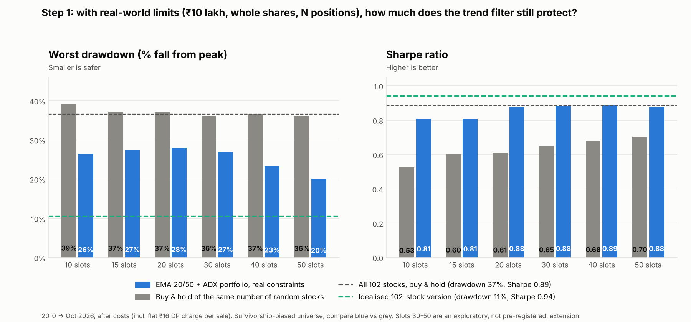
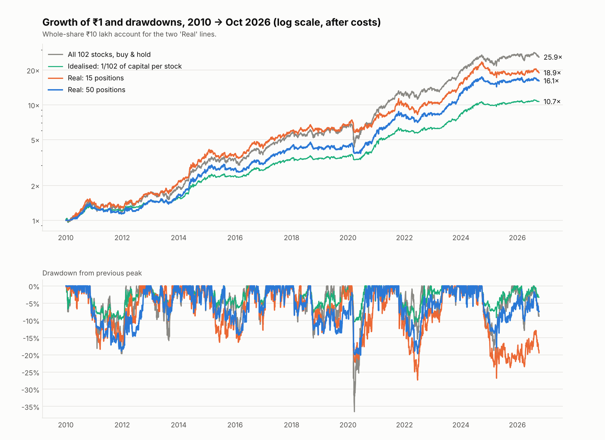

# Step 1 — The EMA 20/50 + ADX strategy as a real, capital-constrained portfolio

*Run on 8 Oct 2026. Code: [`strategy_lab/portfolio.py`](../strategy_lab/portfolio.py), [`portfolio_study.py`](../strategy_lab/portfolio_study.py), [`portfolio_plots.py`](../strategy_lab/portfolio_plots.py). Builds on [the equity strategy report](equity-strategy-research.md). Not investment advice.*

## 1. Question and answer

The earlier study spread capital equally over 102 stocks, which nobody can do with a ₹10 lakh account. **Does the strategy's main benefit — smaller drawdowns — survive when you hold a limited number of positions, buy whole shares and pay real costs?**

**Short answer:** *Partly, and only with many positions.*

1. **The pre-registered test failed.** With 15 positions the worst drawdown was **-27.3%**, not the idealised -10.6%, and it is invested **91%** of the time instead of 56%. Criteria 1, 3 and 4 failed (§3).
2. **Ranking the signals does nothing.** Choosing among simultaneous signals by ADX, by relative strength or by low volatility performed no better than picking at random (§4). The benefit comes from the trend filter, not from stock selection.
3. **Against a fair benchmark the filter still helps.** A passive buy-and-hold of 15 random stocks has a Sharpe of only 0.60 and a -37% drawdown; the trend version had 0.81 and -27%. (Post-hoc comparison — I chose it after seeing the failure — so treat it as an explanation, not a pass.)
4. **More positions restore most of the protection** *(exploratory, not pre-registered)*: 40–50 positions gave a worst drawdown of about -20% to -23% with a Sharpe of 0.88–0.89 and 18–19% a year, versus -36.5%, 0.89 and 21.4% for holding all 102 stocks.



## 2. How it was simulated

| Item | Choice |
|---|---|
| Account | ₹10 lakh (also ₹5 lakh and ₹25 lakh: results were nearly identical) |
| Rule | EMA 20/50 + ADX>20 per stock, exactly as before: buy on the signal, sell when EMA20 closes below EMA50 |
| Positions | At most **K** at once; each new position sized at (current equity ÷ K) at entry and not topped up; **whole shares only** at the actual traded price |
| Choosing among signals | When more stocks signal than there are free slots: rank by a score (ADX, 6-month relative strength, or lowest ATR%) or pick randomly (the null). Primary: fresh signals only, ranked by ADX |
| Costs | STT 0.10% each side, stamp 0.015% on buys, exchange/GST, 0.05% slippage per side, **plus a flat ≈₹16 DP charge per sale** (this hurts small positions) |
| Execution | Signal at the close, trade at the next open; idle cash earns 6%; 2010-01-01 → 8 Oct 2026 |

**Pre-registered criteria** for the primary configuration (K=15, ADX ranking, fresh signals, ₹10 lakh), written before the first run:
(C1) worst drawdown ≤ 60% of buy-and-hold's; (C2) Sharpe ≥ 0.80; (C3) beats the 75th percentile of random picking; (C4) C1 and C2 also hold for K=10 and 20 and for ₹5 and ₹25 lakh.

## 3. Pre-registered result: not met

| Criterion | Result | Verdict |
|---|---|---|
| C1 worst drawdown ≤ 60% of buy-and-hold's (limit -21.9%) | -27.3% | **Fail** |
| C2 Sharpe ≥ 0.80 | 0.81 | Pass (barely) |
| C3 Sharpe above the 75th percentile of random picks (0.85; median 0.82) | 0.81 | **Fail** |
| C4 holds for K=10/20 and ₹5L/₹25L | C1 failed in every one of those configurations | **Fail** |

Primary configuration: 19.2% a year, Sharpe 0.81, worst drawdown -27.3%, 91% invested, about 47 trades a year. Reference points: buy-and-hold of all 102 stocks 21.4% / 0.89 / -36.5%; idealised version 15.2% / 0.94 / -10.6%.

**Why the protection shrank.** In February 2020 about half the stocks (52 of 102) were in a buy signal. The idealised version put 1/102 of its capital into each of them, so it was roughly half in cash and lost about 10% in the Covid crash. A 15-slot book fills instantly from those 52 signals, so it was **100% invested** going into the fall and lost about 22%. A lot of the idealised version's safety was simply that it was never fully invested.

## 4. What did *not* matter (and one thing that hurt)

**Choosing among simultaneous signals — Sharpe ratio, fresh signals only, ₹10 lakh:**

| Slots | Rank by ADX | Rank by 6-month relative strength | Rank by lowest ATR% | Random pick (mean of 30 runs) |
|---|---|---|---|---|
| 10 | 0.81 | 0.86 | 0.76 | 0.76 (± 0.05) |
| 15 | 0.81 | 0.80 | 0.82 | 0.82 (± 0.04) |
| 20 | 0.88 | 0.83 | 0.80 | 0.85 (± 0.03) |

Every ranking rule lands within random picking's noise. Don't spend effort on a clever ranking rule here.

**Chasing late entries hurts.** Letting the book also buy stocks that were *already* in a signal when a slot opens made drawdowns deeper (and low-ATR ranking much worse):

| Slots | Fresh signals only: Sharpe | Worst drawdown | Also fill free slots with stocks already in a signal: Sharpe | Worst drawdown |
|---|---|---|---|---|
| 10 | 0.81 | -26.5% | 0.71 | -35.1% |
| 15 | 0.81 | -27.3% | 0.85 | -30.6% |
| 20 | 0.88 | -28.1% | 0.87 | -29.9% |

The rule's own advice holds: take fresh signals only.

**Account size** between ₹5 lakh and ₹25 lakh made almost no difference at ≤ 20 positions.

## 5. Exploratory: does a larger number of positions restore the protection?

| Slots (K) | Real portfolio: CAGR | Sharpe | Worst drawdown | % invested | Trades / yr | Passive buy & hold of K random stocks: CAGR | Sharpe | Worst drawdown |
|---|---|---|---|---|---|---|---|---|
| 10 | 20.0% | 0.81 | -26.5% | 93% | 32 | 15.1% | 0.53 | -39.1% |
| 15 | 19.2% | 0.81 | -27.3% | 91% | 47 | 16.4% | 0.60 | -37.3% |
| 20 | 19.7% | 0.88 | -28.1% | 89% | 60 | 16.4% | 0.61 | -37.0% |
| 30 * | 19.0% | 0.88 | -27.0% | 85% | 84 | 16.9% | 0.65 | -36.2% |
| 40 * | 18.8% | 0.89 | -23.3% | 83% | 107 | 17.5% | 0.68 | -36.7% |
| 50 * | 18.1% | 0.88 | -20.1% | 79% | 127 | 17.8% | 0.70 | -36.1% |

\* Not in the pre-registered grid — exploratory and counted as additional trials. "Passive" = a random K-stock equal-weight portfolio rebalanced monthly, with costs, averaged over 20 draws.

- The trend portfolio beats the same-size passive portfolio on Sharpe at every K (by 0.17–0.28) and on worst drawdown by 9–16 points.
- Drawdown protection grows steadily with more positions: **-27% to -28% at 15–30 slots, -23% at 40, -20% at 50**. At 50 slots the book is ~80% invested.
- The price of that is activity: about 130 trades a year at 50 slots (roughly 11 a month), on positions of ₹20,000 each in a ₹10 lakh account. In a ₹10 lakh account around 10% of signals could not be filled (share price or free cash too small for the target position), so very high-priced stocks are partly excluded; a larger account fixes that.



## 6. What this means

1. **Treat the earlier headline (-10.6% worst drawdown) as the idealised ceiling, not the expectation.** The realistic figure is about **-20% to -23%** with 40–50 positions, or **-27%** with 15, against -36.5% for holding everything.
2. **The edge over holding the same stocks is real but modest in return terms:** the realistic versions return 18–19% a year against 21.4% for the (survivor-biased) all-stocks benchmark — about 2–3 points less in exchange for a roughly 45% smaller worst drawdown at 50 slots.
3. **Simplest workable form to automate:** EMA 20/50 + ADX>20, fresh signals only, ~40–50 equal positions, daily end-of-day batch. Skip ranking logic.
4. **This still rests on the survivorship-biased 102-stock list**, one 16-year period, approximate costs, and no tax. The exploratory K=30–50 result is the weakest evidence here; it was chosen after seeing the pre-registered test fail.
5. **Next:** step 2 (the same rule on a single Nifty index fund — one instrument, a handful of trades a year — which on the Sensex roughly halved drawdowns over 28 years) now looks more attractive relative to a 40–50-stock book. Compare them before building anything.

## 7. Reproduce

```
python -m strategy_lab.portfolio_study   # pre-registered grid + random-pick baseline (≈50 s)
python -m strategy_lab.portfolio_plots   # by-slots table and the two charts
```
Outputs: `strategy_lab/results/portfolio_grid.csv`, `portfolio_random_baseline.csv`, `portfolio_by_slots.csv`, `portfolio_exploratory_larger_K.csv`, and the charts.
