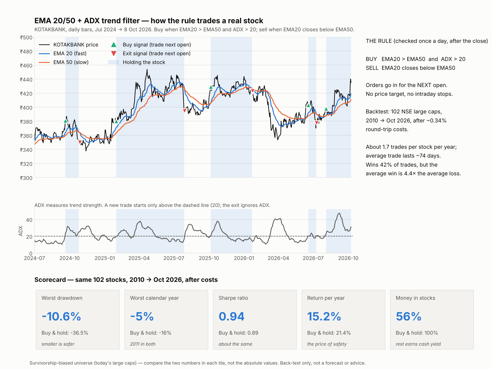
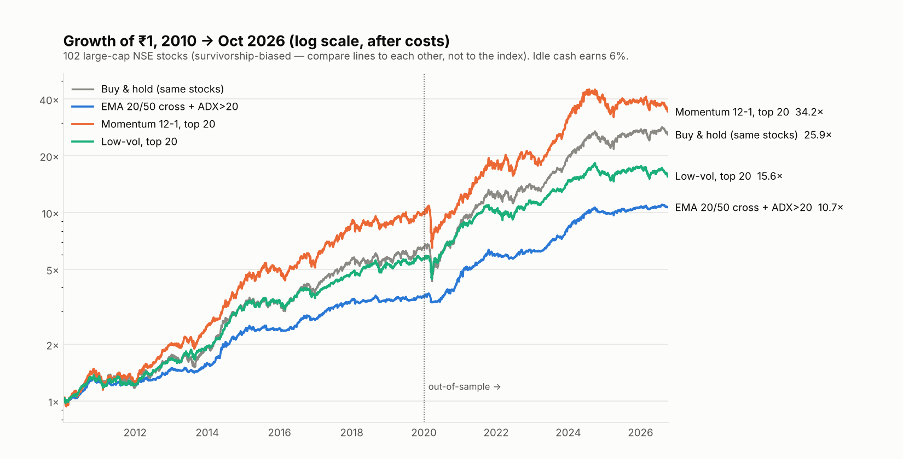
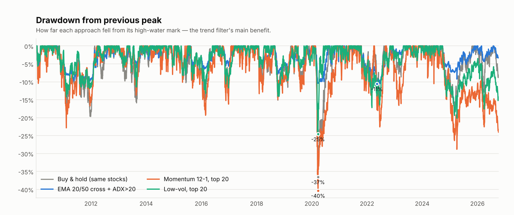
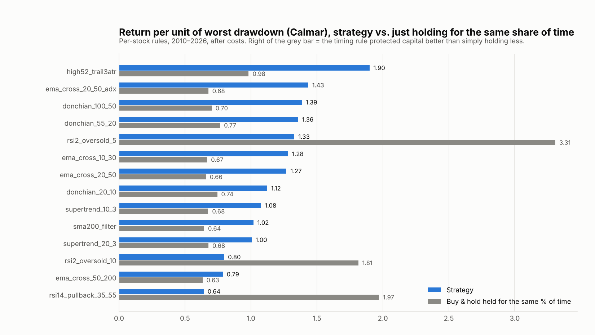

# Equity Strategy Research, Backtesting and Automation — Findings

*Run on 8 Oct 2026. Code, data-cleaning log, every result table and the live scanner are in [`strategy_lab/`](../strategy_lab/). Reproduce with `python -m strategy_lab.research`.*

> **Not investment advice. A backtest is evidence about the past, not a forecast.** The numbers below come from real adjusted NSE prices but from a *survivorship-biased* stock list (see §7), so judge strategies **against each other and against buy-and-hold of the same stocks — not against the index**.

---

## 1. Bottom line

1. **Equities are the better place to start automating.** Daily-bar, long-only delivery trading is simple to backtest, needs no latency, and runs as a once-a-day batch. Options add margin rules, expiry-day rules, multi-leg costs and fat tails; none of that is needed to learn whether a signal has an edge.
2. **No strategy convincingly beat buy-and-hold of the same stocks on a risk-adjusted basis.** The best Sharpe ratio among all 19 variants was 0.94 (EMA 20/50 crossover with an ADX filter) against 0.89 for holding the 102 stocks. That gap is not statistically meaningful.
3. **What the best trend rules did deliver is much smaller drawdowns.** EMA 20/50 + ADX fell at worst **-10.6%** versus **-36.5%** for buy-and-hold (and about -22% for simply holding the stocks the same share of the time), at the price of ~6 points of annual return (15.2% vs 21.4%). The same pattern shows up on the Sensex over 1998–2026, which is a survivorship-free check (§4).
4. **Fast EMA crossovers beat random timing; slow trend rules did not.** EMA 10/30 and 20/50 (±ADX) did better than randomly-timed positions with the same exposure and holding periods. 50/200 EMA, Donchian, SuperTrend and 52-week-high rules did not — their results are explained by simply being invested about half the time in a rising market.
5. **RSI(2) mean reversion has a real gross edge that delivery costs destroy.** Before costs its Sharpe is ~0.86–0.89 and it beats random timing every time; after ~0.34% round-trip costs it falls to 0.19–0.34 and goes negative at 2× costs.
6. **Multiple-testing warning.** 19 variants were tested. At a 10% threshold roughly 2 would pass by luck alone; 5 passed (three of them near-duplicate EMA variants). After a Bonferroni correction only EMA 10/30 clears the bar, and it is also the most trade-hungry of the winners.
7. **Recommended proof-of-concept to automate first: the EMA 20/50 + ADX>20 daily trend filter** — as a *risk-controlled way to hold large-cap equities*, not as a source of alpha. Keep the low-volatility book as a second candidate. Everything else here is research, not production.



---

## 2. What was done

| Item | Choice |
|---|---|
| Universe | 102 liquid NSE large caps (Nifty 50 + Next 50 as known in 2025). All 102 loaded; 13 of them listed after Jan 2010 and join when they list |
| Data | Yahoo Finance public chart API, daily OHLCV adjusted for splits **and dividends** (total return), 2008-01 → 2026-10-08. 2008–09 is indicator warm-up only; scoring starts 1 Jan 2010 |
| Data cleaning | 8 unadjusted corporate actions (Nestlé 2010 split, Vedanta 2026 demerger, Bajaj Finserv/Auto 2008, Adani Ent 2015, Trent 2026, …) spliced out when a one-day fall was ≥ 30%; 1 corrupt open print fixed. Genuine crash days (Covid, 2008, Adani Feb-2023, election day 2024) were deliberately **kept** — see `results/data_cleaning_log.csv` |
| Execution | Signal from the **close** of day *t*, trade at the **open** of day *t+1*. Open-to-open returns. Long-only |
| Costs | Per side: STT 0.10%, exchange/SEBI ≈ 0.003%, stamp 0.015% on buys, ~₹16 DP charge on sells, plus 0.05% slippage → ≈ **0.34% round trip**. Rates from broker price pages found in web search; verify with your broker |
| Idle cash | Earns 6% a year (liquid-fund proxy) so strategies that sit in cash are compared fairly |
| Portfolio model | **Sleeves:** capital split equally across all listed stocks, each sleeve trades its own signal independently — no ranking or selection step that could hide look-ahead. Rank-based books (momentum, low-vol): top-N equal weight, rebalanced monthly, with turnover costs |
| Validation | In-sample 2010–2019 vs out-of-sample 2020–Oct 2026; random-timing null test (200 simulations); cost sensitivity at 0×/1×/2×/3×; two random halves of the universe; yearly consistency; a separate Sensex 1997–2026 test |
| Correctness tests | Alignment test (signal at close → trade at next open), trade/cost arithmetic, rebalance-cost regression test, and a **causality test**: truncating the history never changes an earlier signal, for all 14 per-stock strategies |

**Screen fixed before looking at results.** A strategy passes only if (1) Sharpe > 0 in both in-sample and out-of-sample periods, (2) it beats the random-timing null at p ≤ 0.10, (3) Sharpe at 2× costs is ≥ 70% of Sharpe at 1× costs, and (4) Sharpe > 0 in both random halves of the universe. Survivors are ranked by out-of-sample Sharpe.

**Two bugs found and fixed by sanity checks before reporting** (both are in git history): the rebalance-cost deduction was being reversed the next day (spotted because Sharpe was identical at 0× and 3× costs), and Yahoo's ETF prices proved corrupt, so the Nifty benchmark uses the index series instead.

**Strategies tested (19 variants, 8 families)**

| Family | Variants | Idea |
|---|---|---|
| Trend filter | `sma200_filter` | Long while close > 200-day average |
| EMA crossover | 10/30, 20/50, 50/200, 20/50 + ADX>20 | Long while fast EMA > slow EMA |
| Donchian breakout | 20/10, 55/20, 100/50 | Buy a new N-day high, exit on an M-day low |
| SuperTrend | (10,3), (20,3) | Long while price is above the SuperTrend line |
| 52-week-high breakout | 3×ATR trailing stop | Buy a new 252-day closing high in an uptrend |
| RSI(2) mean reversion | entry < 10, < 5 | Buy deep oversold dips in an uptrend, exit on a close above the 5-day average |
| RSI(14) pullback | 35 → 55 | Buy pullbacks inside an uptrend |
| Cross-sectional | momentum 12-1 top-10 / top-20, momentum 6-1 top-10, momentum 12-1 top-10 with Nifty>200-DMA filter, low-volatility top-20 | Monthly rebalanced factor books |

---

## 3. Results





### 3.1 All strategies, 2010 → Oct 2026, after costs

| Strategy | CAGR | Vol | Sharpe | Max DD | Calmar | % invested | Sharpe 2010-19 (in-sample) | Sharpe 2020-26 (out-of-sample) | Random-timing p | Sharpe at 2× costs | Passes screen |
|---|---|---|---|---|---|---|---|---|---|---|---|
| **Buy & hold, same 102 stocks** | 21.4% | 17.4% | 0.89 | -36.5% | 0.59 | 100% | 0.91 | 0.86 | – | – |  |
| Buy & hold Nifty 50 (price index) | 9.0% | 16.4% | 0.26 | -38.4% | 0.23 | 100% | 0.25 | 0.26 | – | – |  |
| `sma200_filter` | 14.9% | 10.4% | 0.84 | -14.6% | 1.02 | 65% | 0.74 | 0.98 | 0.184 | 0.71 | no |
| `ema_cross_10_30` | 15.3% | 9.8% | 0.93 | -11.9% | 1.28 | 59% | 0.81 | 1.07 | 0.005 | 0.78 | **YES** |
| `ema_cross_20_50` | 15.4% | 10.2% | 0.91 | -12.2% | 1.27 | 61% | 0.81 | 1.05 | 0.060 | 0.83 | **YES** |
| `ema_cross_50_200` | 16.1% | 11.5% | 0.86 | -20.4% | 0.79 | 70% | 0.93 | 0.79 | 0.836 | 0.84 | no |
| `ema_cross_20_50_adx` | 15.2% | 9.5% | 0.94 | -10.6% | 1.43 | 56% | 0.85 | 1.06 | 0.025 | 0.88 | **YES** |
| `donchian_20_10` | 10.8% | 7.6% | 0.64 | -9.6% | 1.12 | 44% | 0.59 | 0.71 | 0.950 | 0.47 | no |
| `donchian_55_20` | 11.2% | 7.2% | 0.71 | -8.2% | 1.36 | 41% | 0.62 | 0.83 | 0.930 | 0.63 | no |
| `donchian_100_50` | 13.6% | 8.7% | 0.86 | -9.8% | 1.39 | 51% | 0.85 | 0.88 | 0.602 | 0.83 | no |
| `supertrend_10_3` | 13.4% | 9.3% | 0.78 | -12.4% | 1.08 | 57% | 0.72 | 0.86 | 0.572 | 0.67 | no |
| `supertrend_20_3` | 12.6% | 9.2% | 0.72 | -12.6% | 1.00 | 56% | 0.64 | 0.81 | 0.930 | 0.60 | no |
| `high52_trail3atr` | 10.0% | 4.9% | 0.79 | -5.3% | 1.90 | 26% | 0.82 | 0.76 | 0.587 | 0.69 | no |
| `rsi2_oversold_10` | 6.7% | 3.6% | 0.19 | -8.4% | 0.80 | 11% | 0.31 | 0.04 | 0.005 | -0.49 | no |
| `rsi2_oversold_5` | 6.8% | 2.4% | 0.34 | -5.1% | 1.33 | 6% | 0.43 | 0.22 | 0.005 | -0.22 | no |
| `rsi14_pullback_35_55` | 7.9% | 3.7% | 0.49 | -12.3% | 0.64 | 10% | 0.71 | 0.29 | 0.771 | 0.40 | no |
| `xs_momentum_12-1_top10` | 21.9% | 23.3% | 0.73 | -41.7% | 0.53 | fully invested | 0.88 | 0.58 | 0.323 | 0.68 | no |
| `xs_momentum_12-1_top20` | 23.5% | 20.4% | 0.87 | -40.3% | 0.58 | fully invested | 1.09 | 0.65 | 0.065 | 0.82 | **YES** |
| `xs_momentum_6-1_top10` | 21.2% | 23.6% | 0.70 | -43.3% | 0.49 | fully invested | 0.85 | 0.54 | 0.328 | 0.62 | no |
| `xs_momentum_12-1_top10_niftyRegime` | 19.6% | 18.8% | 0.75 | -24.4% | 0.80 | fully invested | 0.70 | 0.82 | 0.164 | 0.69 | no |
| `xs_lowvol_top20` | 17.8% | 13.6% | 0.87 | -24.6% | 0.73 | fully invested | 1.02 | 0.69 | 0.050 | 0.83 | **YES** |

*Sharpe is measured over the risk-free rate (6%). "Random-timing p" = the share of random-timing simulations (same exposure, same holding lengths, same number of trades) that did at least as well as the strategy; low is good. For the rank-based books it compares against randomly-picked stocks, gross of costs. "Passes screen" is the pre-registered screen from §2.*

### 3.2 Is it the timing, or just being invested less of the time?

A trend rule that is invested 55% of the time should shrink drawdowns simply because it holds less. The fair comparison is buy-and-hold held for the same share of the time:

| Strategy | % invested | Max DD | Max DD of buy & hold held the same % of time | Calmar | Calmar of matched buy & hold |
|---|---|---|---|---|---|
| `sma200_filter` | 65% | -14.6% | -25.2% | 1.02 | 0.64 |
| `ema_cross_10_30` | 59% | -11.9% | -22.8% | 1.28 | 0.67 |
| `ema_cross_20_50` | 61% | -12.2% | -23.8% | 1.27 | 0.66 |
| `ema_cross_50_200` | 70% | -20.4% | -26.8% | 0.79 | 0.63 |
| `ema_cross_20_50_adx` | 56% | -10.6% | -22.0% | 1.43 | 0.68 |
| `donchian_20_10` | 44% | -9.6% | -17.4% | 1.12 | 0.74 |
| `donchian_55_20` | 41% | -8.2% | -16.4% | 1.36 | 0.77 |
| `donchian_100_50` | 51% | -9.8% | -20.0% | 1.39 | 0.70 |
| `supertrend_10_3` | 57% | -12.4% | -22.0% | 1.08 | 0.68 |
| `supertrend_20_3` | 56% | -12.6% | -21.9% | 1.00 | 0.68 |
| `high52_trail3atr` | 26% | -5.3% | -10.3% | 1.90 | 0.98 |
| `rsi2_oversold_10` | 11% | -8.4% | -4.3% | 0.80 | 1.81 |
| `rsi2_oversold_5` | 6% | -5.1% | -2.1% | 1.33 | 3.31 |
| `rsi14_pullback_35_55` | 10% | -12.3% | -3.9% | 0.64 | 1.97 |



The trend and breakout rules cut the worst drawdown to roughly **half** (49–58%) of what the same exposure would have produced passively; the slow EMA 50/200 is the exception (76%). The three RSI rows fail this comparison — after costs they earn less than passively holding the stocks for the same small slice of time.

### 3.3 Trade-level statistics (closed trades, after costs)

| Strategy | Closed trades | Trades / stock / yr | Win rate | Avg win ÷ avg loss | Avg net trade | Profit factor | Avg hold (days) |
|---|---|---|---|---|---|---|---|
| `ema_cross_20_50_adx` | 2,965 | 1.73 | 42% | 4.37 | 8.5% | 3.10 | 74 |
| `ema_cross_10_30` | 6,715 | 3.93 | 36% | 3.93 | 3.4% | 2.18 | 35 |
| `ema_cross_20_50` | 3,662 | 2.14 | 38% | 4.82 | 7.2% | 2.90 | 65 |
| `donchian_100_50` | 1,412 | 0.83 | 48% | 4.13 | 14.9% | 3.78 | 137 |
| `supertrend_10_3` | 4,921 | 2.88 | 42% | 2.79 | 3.9% | 2.05 | 45 |
| `high52_trail3atr` | 2,315 | 1.35 | 43% | 2.88 | 4.1% | 2.17 | 44 |
| `rsi2_oversold_10` | 11,603 | 6.78 | 62% | 0.70 | 0.2% | 1.13 | 4 |

Trend rules win only 36–48% of trades, but average winners are 3–5× the average loser. A high win rate is **not** the goal: RSI(2) wins 62% of trades and still loses to costs because the average trade nets only 0.16%.

### 3.4 Year-by-year consistency (% return per calendar year; 2026 is year-to-date)

| Strategy | 2010 | 2011 | 2012 | 2013 | 2014 | 2015 | 2016 | 2017 | 2018 | 2019 | 2020 | 2021 | 2022 | 2023 | 2024 | 2025 | 2026 | Years > 0 | Worst year |
|---|---|---|---|---|---|---|---|---|---|---|---|---|---|---|---|---|---|---|---|
| **Buy & hold, same 102 stocks** | 41 | -16 | 49 | 12 | 62 | 8 | 12 | 46 | 3 | 14 | 30 | 46 | 10 | 44 | 23 | 12 | -5 | 15/17 | -16% |
| Buy & hold Nifty 50 (price index) | 18 | -23 | 26 | 4 | 35 | -7 | 5 | 28 | 3 | 13 | 15 | 26 | 3 | 19 | 9 | 10 | -15 | 14/17 | -23% |
| `ema_cross_20_50_adx` | 28 | -5 | 22 | 7 | 46 | 5 | 11 | 26 | 1 | 5 | 26 | 32 | 4 | 34 | 20 | 7 | 0 | 15/17 | -5% |
| `ema_cross_10_30` | 29 | -8 | 26 | 12 | 41 | 0 | 12 | 24 | 1 | 4 | 40 | 30 | 6 | 36 | 17 | 4 | -3 | 15/17 | -8% |
| `donchian_100_50` | 26 | -5 | 16 | 7 | 45 | 8 | 10 | 23 | 1 | 8 | 16 | 30 | 4 | 26 | 18 | 6 | -1 | 15/17 | -5% |
| `high52_trail3atr` | 19 | 2 | 13 | 7 | 27 | 3 | 8 | 12 | 6 | 5 | 13 | 15 | 3 | 19 | 11 | 6 | 2 | 17/17 | 2% |
| `xs_momentum_12-1_top20` | 41 | -11 | 61 | 24 | 70 | 19 | 7 | 61 | 0 | 15 | 17 | 53 | 12 | 57 | 26 | 0 | -14 | 13/17 | -14% |
| `xs_lowvol_top20` | 35 | -10 | 39 | 16 | 58 | 11 | 6 | 31 | 12 | 7 | 45 | 25 | 9 | 32 | 9 | 9 | -11 | 15/17 | -11% |

Every approach was positive in 13–17 of the 17 years (momentum fewest at 13). The trend rules' benefit shows in bad years: 2011 (-5% / -8% for the EMA rules vs -16% for buy-and-hold).

### 3.5 Does the in-sample winner stay the winner? (selection noise)

Choosing the best-looking variant per family on 2010–2019 and judging it on 2020–2026: the in-sample EMA winner (50/200) had a *lower* out-of-sample Sharpe than its family's median, and momentum's Sharpe fell from 1.09 to 0.65. This is exactly why parameters should not be optimised on a single backtest — see `results/family_selection_is_to_oos.csv`.

---

## 4. Survivorship-free check: the same rules on the Sensex, 1998–2026

The stock study can't see stocks that fell out of the indices. The Sensex reconstitutes itself and the sample includes the dot-com bust and 2008, which the stock study never touches. Assumed costs: 0.10% round trip (ETF/futures-like). The index is a price index (no dividends), so every row, including buy-and-hold, is understated by ~1.3%/yr.

**1998-2009**

| Rule | CAGR | Sharpe | Max DD | % invested |
|---|---|---|---|---|
| Buy & hold Sensex | 13.9% | 0.39 | -61.4% | 100% |
| `ema_cross_10_30` | 16.8% | 0.58 | -43.8% | 61% |
| `ema_cross_20_50` | 21.9% | 0.79 | -38.0% | 59% |
| `ema_cross_20_50_adx` | 18.5% | 0.66 | -31.8% | 56% |
| `donchian_100_50` | 15.4% | 0.55 | -26.6% | 46% |
| `sma200_filter` | 15.8% | 0.53 | -45.2% | 61% |
| `supertrend_10_3` | 13.8% | 0.46 | -52.1% | 57% |

**2010-2026**

| Rule | CAGR | Sharpe | Max DD | % invested |
|---|---|---|---|---|
| Buy & hold Sensex | 8.9% | 0.24 | -37.3% | 100% |
| `ema_cross_10_30` | 10.0% | 0.40 | -14.1% | 63% |
| `ema_cross_20_50` | 8.6% | 0.27 | -21.9% | 67% |
| `ema_cross_20_50_adx` | 9.1% | 0.33 | -14.2% | 59% |
| `donchian_100_50` | 6.9% | 0.13 | -18.9% | 54% |
| `sma200_filter` | 5.5% | 0.01 | -21.2% | 74% |
| `supertrend_10_3` | 6.2% | 0.07 | -21.8% | 57% |

**1998-2026**

| Rule | CAGR | Sharpe | Max DD | % invested |
|---|---|---|---|---|
| Buy & hold Sensex | 11.0% | 0.31 | -61.4% | 100% |
| `ema_cross_10_30` | 12.8% | 0.48 | -43.8% | 62% |
| `ema_cross_20_50` | 13.9% | 0.54 | -38.0% | 64% |
| `ema_cross_20_50_adx` | 12.9% | 0.50 | -31.8% | 58% |
| `donchian_100_50` | 10.4% | 0.35 | -26.6% | 51% |
| `sma200_filter` | 9.6% | 0.29 | -45.2% | 68% |
| `supertrend_10_3` | 9.3% | 0.28 | -52.1% | 57% |

Reading it:
* Over the full 28 years, EMA 20/50 (and the ADX variant) roughly **halved the worst drawdown** (-38% / -32% vs -61%) and **lifted the Sharpe ratio** (0.54 / 0.50 vs 0.31).
* The benefit is uneven: it was strongest through the 1998–2009 crashes. In 2010–2026 only the fast EMA rules clearly improved on buy-and-hold; `sma200_filter` (Sharpe 0.01) and 50/200-type slow rules did not. Trend rules are crash insurance that costs money in calm, rising markets.

---

## 5. Answers to your five questions

**1. What are the best equity strategies for the Indian market?**
In this evidence, ranked by *usefulness*, not by headline return: (a) **trend filters on large-cap stocks** — fast/medium EMA crossovers (10/30, 20/50, with ADX>20) — for drawdown control; (b) **low-volatility** selection (top-20 lowest-vol stocks, monthly) — Sharpe 0.87, worst drawdown -24.6% vs -36.5%, beat random picking at p = 0.05; (c) **cross-sectional momentum** — the best-documented Indian factor (NSE's own Nifty200 Momentum 30 beat the Nifty 200, 19.2% vs 15.1% CAGR since 2005, though much of that history is back-tested and drawdowns were as deep or deeper in 2008). On our survivor-only list momentum did *not* beat plain buy-and-hold on Sharpe (0.87 vs 0.89) and decayed out-of-sample. Not viable after delivery costs: RSI(2) mean reversion.

**2. Which showed the best consistency and risk-adjusted returns?**
By Calmar (return per unit of worst drawdown): 52-week-high trail (1.90, but only 25% invested and 10% CAGR), EMA 20/50+ADX (1.43), Donchian 100/50 (1.39), Donchian 55/20 (1.36), EMA 10/30 (1.28), against 0.59 for buy-and-hold. By Sharpe, everything that works clusters at 0.8–0.95 — about the same as buy-and-hold. Treat the ranking inside that cluster as noise.

**3. Which are suitable for full automation?**
All the daily-bar strategies here: each is a deterministic rule with 1–2 parameters, needs only end-of-day data, and produces a handful of orders per day. EMA crossovers and Donchian breakouts are the simplest (no state beyond the position). The rank-based books need one monthly rebalance. RSI(2) is automatable but not worth it at delivery costs.

**4. Which are easiest to backtest?**
Same list. Daily adjusted OHLC is enough, and results are far less sensitive to fill assumptions than intraday systems. The main traps are survivorship bias, corporate-action adjustments, and look-ahead — the repo has a causality test for the last. *Intraday* strategies (ORB, VWAP) need minute data and a careful slippage model; defer them.

**5. Which are most practical through broker APIs?**
EMA/Donchian trend rules: run once after the close (data is final by ~16:00 IST), queue the next day's orders, place them at/near the open with market protection (required for market orders under the current rules). Low-frequency (~2–4 trades per stock per year), no latency requirement, fits comfortably under the 10-orders/second threshold, and a static IP + daily re-login is all the infrastructure needed. **One gap: the sleeve portfolio is a research construct** (1/102 of capital per stock). A live book needs a capital-constrained version — a position cap (say 10–15 names), a way to choose among simultaneous signals, whole-share sizing (a ₹43,000 Bosch share doesn't fit a ₹10,000 sleeve). That version has now been tested — see [Step 1: the strategy as a real capital-constrained portfolio](equity-step1-realistic-portfolio.md): the pre-registered test failed (worst drawdown -27% with 15 positions rather than -11%), but about -20% to -23% is achievable with 40–50 positions.

---

## 6. Which stocks match the strategies today? (scan of the last close, 8 Oct 2026)

`python -m strategy_lab.scan` recomputes this from fresh prices. The Nifty 50 is **below its 200-day average**, and **no stock produced a new entry signal at the last close** under any of the six scanned strategies. What the scanner finds are stocks *already in a signal* (late entries are not recommended by these rules) and recent exits:

| Strategy | Currently long (holding) | Just exited at last close | New entries at last close |
|---|---|---|---|
| `donchian_100_50` | 14 | 4 | 0 |
| `ema_cross_10_30` | 9 | 1 | 0 |
| `ema_cross_20_50` | 13 | 2 | 0 |
| `ema_cross_20_50_adx` | 13 | 2 | 0 |
| `high52_trail3atr` | 2 | 1 | 0 |
| `supertrend_10_3` | 15 | 3 | 0 |

Stocks that are long under at least 3 of the 6 scanned strategies (liquid names only, 20-day average traded value ≥ ₹20 crore):

| Stock | Strategies long (of 6) | Last close (₹) | Days in the current EMA 20/50+ADX signal | 20-day avg traded value (₹ cr) |
|---|---|---|---|---|
| AUROPHARMA | 6 | 1,645.00 | 114 | 134 |
| DIVISLAB | 6 | 9,361.00 | 115 | 463 |
| KOTAKBANK | 5 | 435.00 | 47 | 872 |
| COALINDIA | 4 | 409.35 | 12 | 316 |
| ADANIPORTS | 4 | 1,708.00 | 11 | 393 |
| DRREDDY | 4 | 1,180.00 | 4 | 275 |
| ZYDUSLIFE | 4 | 1,112.00 | 103 | 186 |
| DLF | 3 | 636.95 | 77 | 292 |
| BOSCHLTD | 3 | 43,155.00 | 121 | 112 |
| PERSISTENT | 3 | 5,468.00 | 49 | 234 |
| PNB | 3 | 115.29 | 51 | 161 |
| COFORGE | 3 | 1,814.30 | 91 | 478 |
| HAL | 3 | 4,647.40 | 118 | 356 |

Full lists with exit levels: `strategy_lab/results/scan_2026-10-08_signals.csv`. For the EMA rules the exit is "EMA20 closes below EMA50"; for Donchian, "close below the 50-day low".

**Factor books as of today** (they only rebalance at month end, so these are *rankings*, not trades):

Top 10 by 12-1 month momentum:

| Rank | Stock | 12-1 month return | Annualised vol |
|---|---|---|---|
| 1 | VEDL | 71.6% | 36.2% |
| 2 | SHRIRAMFIN | 71.5% | 36.1% |
| 3 | DIVISLAB | 64.2% | 24.3% |
| 4 | AUROPHARMA | 52.4% | 25.9% |
| 5 | TITAN | 47.3% | 23.8% |
| 6 | ABB | 45.0% | 30.7% |
| 7 | ADANIPOWER | 39.4% | 35.6% |
| 8 | TORNTPHARM | 38.2% | 22.2% |
| 9 | INDUSINDBK | 38.2% | 29.2% |
| 10 | BAJAJ-AUTO | 37.3% | 23.9% |

Top 10 lowest-volatility:

| Rank | Stock | Annualised vol | 12-1 month return |
|---|---|---|---|
| 1 | MARICO | 18.5% | 15.9% |
| 2 | NTPC | 19.3% | 0.0% |
| 3 | BRITANNIA | 19.4% | -13.5% |
| 4 | SUNPHARMA | 19.6% | 20.3% |
| 5 | ICICIBANK | 19.6% | 6.8% |
| 6 | APOLLOHOSP | 19.6% | 18.0% |
| 7 | LUPIN | 19.9% | 9.7% |
| 8 | NESTLEIND | 20.8% | 22.5% |
| 9 | POWERGRID | 20.8% | -1.9% |
| 10 | CIPLA | 21.0% | -5.4% |

A signal is a rule firing, not a forecast. Note the contrast in a market below its 200-day average: the trend rules are holding mostly pharma plus a few banks, energy and infrastructure names, while the momentum list is led by VEDL and SHRIRAMFIN (VEDL's figure may be distorted by the April 2026 demerger, which the data cleaning treats as a non-economic drop).

---

## 7. What this does NOT prove (read before trusting any number)

1. **Survivorship bias is large.** The universe is today's large caps. Equal-weight buy-and-hold of them returned 21.4%/yr against 9.0% (price) for the Nifty 50 — the ~12-point gap is mostly selection (stocks that rose are the ones now in the index). This biases *absolute* returns and especially long-only momentum. The relative conclusions and the Sensex check are more trustworthy than the absolute CAGRs.
2. **One market, one 16-year regime.** 2010–2026 was a strong, mostly one-way market for Indian large caps. Trend rules are untested in a long sideways or falling market except via the Sensex index series.
3. **Multiple testing.** 19 variants on the same data; only EMA 10/30 survives a strict correction, and with a small margin.
4. **Costs are approximations** (broker/DP charges and slippage assumed; 0.05% slippage per side may be optimistic for mid-cap names or large orders). **Taxes are not modelled.** Holding periods of 1–6 months mostly fall under short-term capital-gains tax (20% as of my knowledge; verify), which is a large drag on frequent-turnover strategies.
5. **Sleeve ≠ a real portfolio** (see §5, Q5). Whole shares, position caps and capital limits will change the results.
6. **Data quality.** Yahoo is free, unofficial and had to be cleaned (§2). Before live money, repeat the study on broker/vendor data (Dhan/Zerodha historical or a licensed vendor).
7. **Long-only, daily bars, cash segment.** No shorting, no intraday, no leverage, no options.
8. **The null test preserves exposure and holding length but not market regime.** It answers "does timing add value", not "will this make money next year".

---

## 8. Recommended research process and next steps

**The process to follow for every idea (keeps you honest):**
1. **Write the hypothesis and the pass/fail criteria before testing** — as done in §2. Count every variant you try.
2. **Build on clean data** and write tests that fail on look-ahead. Fix data first, strategies second.
3. **Test on a development period only; touch the out-of-sample period once.** Use broad parameter plateaus, not the single best setting.
4. **Compare against the right benchmarks**: buy-and-hold, buy-and-hold at equal exposure, and a random-timing null.
5. **Stress costs, universe and period.** Require the edge to survive 2× costs, both halves of the universe, and a different market/period.
6. **Paper-trade the scanner** for ≥ 3 months and compare real fills to the model's assumed fills before any capital.
7. **Go live small, then scale only on evidence**; define in advance the rule that switches a strategy off.

**Concrete next steps, in order:**

| # | Step | Why |
|---|---|---|
| 1 ✅ done | **Capital-constrained portfolio version** (results: [step 1 report](equity-step1-realistic-portfolio.md)): max 10–15 positions, rules to rank simultaneous signals (e.g., by ADX, relative strength or low ATR%), whole-share sizing, sector cap, ATR-based position size so each trade risks ~0.5–1% of equity | The most important gap between this study and a tradable system |
| 2 | **Remove survivorship**: point-in-time index constituents (NSE index reconstitution files or a paid dataset), include delisted stocks | Makes absolute results meaningful and tests momentum properly |
| 3 | **Wider universe** (Nifty 500 with a liquidity filter) and a **second period** (pre-2010 stocks if data allows) | Momentum and factor effects live in broader universes |
| 4 | **Combine, but test as one new hypothesis**: trend filter × low-vol/momentum ranking (e.g., trade only low-vol names above their trend) | Likely the most productive idea, but each combination counts as another trial |
| 5 | **Walk-forward re-estimation** and report a deflated Sharpe ratio for the final candidates | Quantifies how much of the result is selection |
| 6 | **Switch from Yahoo to broker historical data**; reconcile any differences | Needed anyway for live operation |
| 7 | **Intraday research** (ORB, VWAP) on minute data with a proper slippage model — only after daily strategies are in paper trading | Higher turnover means costs dominate; data is harder |
| 8 | **Minimal automation**, nothing more: nightly job → signals → orders file → broker API (placing orders at the open with market protection), a kill switch, and a position reconciliation. No dashboards, no notification stack | Matches your scope: research first, automate what survives |
| 9 | **Paper-trade ≥ 3 months, then go live at small size** | Real fills vs model |

---

## 9. Reproduce

```
pip install -r strategy_lab/requirements.txt
python -m unittest strategy_lab.tests.test_engine -v   # alignment, costs, no-look-ahead
python -m strategy_lab.research                        # full study (~100 s; downloads ~100 stocks once, then cached)
python -m strategy_lab.index_check                     # Sensex 1997-2026 survivorship-free check
python -m strategy_lab.plots                           # charts
python -m strategy_lab.scan                            # today's signals (refreshes prices)
```

Outputs land in `strategy_lab/results/`: `summary.csv`, `yearly_returns.csv`, `trades.csv`, `family_selection_is_to_oos.csv`, `null_sharpes.csv`, `index_check_sensex.csv`, `data_cleaning_log.csv`, charts, and dated scan files.

**Sources for the external facts used here:** [NSE Nifty200 Momentum 30 whitepaper (2026)](https://www.niftyindices.com/docs/default-source/indices/nifty200-momentum-30/momentum-strategy-whitepaper_2026.pdf); [Momentum and liquidity in India (Pacific-Basin Finance Journal 2023, via Manipal)](https://researcher.manipal.edu/en/publications/momentum-reversals-and-liquidity-indian-evidence/); [Testing technical trading rules across market cycles, India (Colombo Business Journal)](https://cbj.sljol.info/articles/56); [Upstox brokerage and statutory charges](https://upstox.com/brokerage-charges/); [Zerodha brokerage breakdown 2026](https://stockcalc.in/blog/zerodha-brokerage-charges-2026-full-breakdown). Index-level Indian studies generally find technical-rule profits shrink or vanish after costs — consistent with the RSI(2) result here.
