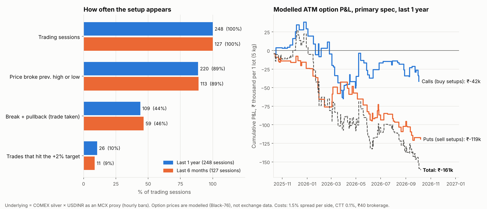

# Silver options — previous-day high/low break-and-pullback: research and backtest

*Own-account research. Data to 9–10 Oct 2026. Protocol and pass/fail criteria were committed before any result was computed
(`docs/silver-options-protocol.md`, commit `bb08af0`).*



## 1. Verdict

**Not supported.** The pattern appears on about 44% of sessions, so there is plenty to trade, but it has no measurable edge.

- On the silver price itself the rule earns about **+0.05% per trade after costs** over the last year (95% interval −0.18% to +0.27%) and **−0.02%** over the last six months. That is indistinguishable from zero.
- Bought as an at-the-money option, the **modelled** result is **−1.8% of premium per trade** over the year (−₹1,376 per trade, **−₹1.61 lakh over 117 trades** per 5 kg lot) and **−2.3% / −₹64,500 over 62 trades** in the last six months. Zero of 36 parameter combinations were profitable.
- The option legs lose mainly to the bid-ask spread and time decay on a rule that moves the underlying only a fraction of a percent on average. With the spread set to zero the year turns slightly positive (+1.4%, interval −1.1% to +4.0%), i.e. still not significant.
- Selling the breakdowns (buying puts) is the weak side: −4.4% of premium per trade (interval −7.3% to −1.4%). Silver rose about 41% over the year, which probably explains much of that, but I cannot separate that from the rule being poor.

**Important limit on all of this:** I could not get historical MCX silver **option** prices (no free source exists). The option results come from a pricing model on a proxy of the MCX silver price, not from option charts. The underlying-price result is the more reliable half; the option result is an estimate whose sign depends on assumptions I list in §6.

## 2. How silver options work on MCX

| Item | What I found | Status |
|---|---|---|
| Contracts | Options exist on **Silver (30 kg)** and **Silver Mini (5 kg)** futures; they are options on futures, one option per futures contract. I found no source for options on Silver Micro (1 kg) or the new Silver 100 (100 g). | [secondary sources](https://www.angelone.in/news/hindi/stocks/mcx-revises-silver-options-strike-price-gap-to-rs-1000-effective-january-29-2026) |
| Lot size | 30 kg (Silver) and 5 kg (Silver Mini, SILVERM). One option lot = one futures lot. | [Dhan](https://dhan.co/commodity/silver-mini-option-chain/), [TradingQnA](https://tradingqna.com/t/mcx-is-launching-options-on-silver-mini-5kg-futures-contracts/114634) |
| Strike interval | **₹1,000** since 29 Jan 2026 (was ₹250); older ₹250 strikes stay listed. MCX circular 046/2026. | [Zerodha bulletin](https://zerodha.com/marketintel/bulletin/440832/modification-in-the-contract-specifications-in-silver-and-silver-mini-options-contracts) |
| Style / settlement | European; exercised ITM options **devolve into futures** of the same month. | [Fyers notice](https://fyers.in/notice-board/silver-options-expiry-24th-february-2026-itm-options-to-devolve-into-futures/) |
| Expiry | Monthly. Rule at launch: 3 business days before the first day of the futures tender period. Recent expiries: 27 Jan, 24 Feb, 24 Apr, **27 Oct 2026**. | [TradingQnA](https://tradingqna.com/t/mcx-is-launching-options-on-silver-mini-5kg-futures-contracts/114634), [Dhan](https://dhan.co/commodity/silver-mini-option-chain/) |
| Premium tick | ₹0.50 per kg (launch spec, 2021). | [TradingQnA](https://tradingqna.com/t/mcx-is-launching-options-on-silver-mini-5kg-futures-contracts/114634) |
| Hours | 09:00–23:30 (Apr–Oct), 09:00–23:55 (Nov–Mar), Mon–Fri. | [Dhan](https://dhan.co/commodity/silver-mini-option-chain/) |
| Margin | **Buying** an option costs the premium only. **Selling** needs SPAN + extreme-loss margin, plus extra margin the exchange adds in volatile periods (an extra 7% on silver futures was levied in Feb 2026 and removed on 19 Feb). ITM/near-the-money long options face extra margin from the day before expiry. | [TradingQnA](https://tradingqna.com/t/mcx-is-launching-options-on-silver-mini-5kg-futures-contracts/114634), [Fyers](https://fyers.in/notice-board/gold-silver-futures-margin-revision-effective-19-feb-2026/) |
| Futures margin (for scale) | Roughly ₹40,000–60,000 per Silver Mini lot, ₹2.5–3 lakh per Silver lot; the sources disagree and are undated, so check your broker. | [MCXTrends](https://www.mcxtrends.in/mcxsilver-intelligence) |
| Quantity / freeze limits, option price bands | **Not found.** Check the MCX circular list and your broker. | gap |

**Scale at today's price.** Silver Mini was about ₹2.28 lakh/kg on 9 Oct 2026, so one 5 kg lot controls about **₹11.4 lakh** of silver and one 30 kg lot about **₹68 lakh**. In my model an ATM Silver Mini option cost **₹58,000 (median) / ₹75,000 (mean)** per lot over the last year at about 57% annualised volatility, with 23 days to expiry on average. A 30 kg lot costs six times that, so the Silver Mini is the practical size for a small account.

## 3. Strategy as tested

Your description leaves several things open; I fixed them before running (details in the protocol file).

- **Session** = MCX day 09:00–23:30 IST. Previous high/low = previous session's.
- **Break** = any hourly bar trades beyond the previous high (low). **Pullback** = a *later* bar trades back 1% inside (buy: to 99 when the high was 100; sell: to 96 when the low was 95). Entry at that price.
- **Buy setup → buy an ATM call. Sell setup → buy an ATM put** (no short options).
- **Exit:** +2% on the underlying, **or** a 1% stop (your description has no stop, so I added one and also tested none), **or** flat at session close.
- **Costs:** option bid-ask 1.5% of premium per side, 0.1% commodity transaction tax on the sale, ₹40 brokerage; 0.10% round trip on the underlying.
- **Ambiguity inside an hourly bar is resolved against the trader** (stop before target; no entry-bar target). The optimistic version is reported as a bound.

## 4. Opportunities: sessions and how often the setup occurred

Sessions are those in the proxy data; ~10–13 per year are missing because COMEX was closed on US holidays while MCX may have traded.

| | Last 6 months (10 Apr–9 Oct 2026) | Last 1 year (10 Oct 2025–9 Oct 2026) |
|---|---|---|
| **Trading sessions** | **127** | **248** |
| Price broke previous high | 60 (47%) | 128 (52%) |
| Price broke previous low | 67 (53%) | 113 (46%) |
| Broke either level | 113 (89%) | 220 (89%) |
| Buy setup (break + 1% pullback) | 29 (23%) | 60 (24%) |
| Sell setup (break + 1% pullback) | 33 (26%) | 57 (23%) |
| **Sessions with at least one setup** | **59 (46%)** | **109 (44%)** |
| Both buy and sell in the same session | 3 | 8 |
| **Trades taken** | **62** | **117** |
| Hit the +2% target | 11 (18% of trades) | 26 (22%) |
| Hit the −1% stop | 25 (40%) | 51 (44%) |
| Closed at session end | 26 (42%) | 40 (34%) |

So the **probability that a given session offers a trade is about 44–46%**, roughly 10 trades a month. Silver is volatile enough (median daily range 3.2–3.7%) that breaking the previous day's high or low is almost routine (89% of sessions). Only about one trade in five reaches +2% and about two in five are stopped out.

How the number moves with the pullback depth (1-year): 0% retest → 185 trades; **1% → 117**; 2% → 59.

## 5. Performance

**Primary spec (p = 1%, target 2%, stop 1%, intraday):**

| | Trades | Win rate | Mean per trade | 95% interval | Total |
|---|---|---|---|---|---|
| Underlying, 6M, net of 0.10% | 62 | 39% | −0.02% | −0.29% to +0.29% | −0.95% (sum of trade returns) |
| Underlying, 1Y | 117 | 44% | +0.05% | −0.18% to +0.27% | +5.5% |
| Option return on premium, 6M | 62 | 34% | −2.3% | −5.7% to +1.6% | **−₹64,500 / lot** |
| Option return on premium, 1Y | 117 | 36% | −1.8% | −4.2% to +0.7% | **−₹1,61,000 / lot** |
| (2Y, extra) option | 202 | 42% | −0.8% | −3.1% to +1.5% | −₹1,66,000 / lot |

Intervals are day-clustered bootstrap. The one-year equity curve in the chart peaked at about +₹27,000 in December (the call leg alone reached about +₹38,000) and then fell to −₹1.61 lakh; maximum drawdown was about **₹1.88 lakh per lot against an average premium of ₹75,000**.

**Pre-registered criteria (1-year window):**

| # | Criterion | Result |
|---|---|---|
| 1 | Underlying net mean > 0, interval above 0 | **Fail** (interval −0.18% to +0.27%) |
| 2 | Option return on premium > 0, interval above 0 | **Fail** (−1.8%) |
| 3 | Holds under the conservative intrabar rule | **Fail** (same test as 1–2) |
| 4 | Beats random entries (same exits), p < 0.05 | **Pass, barely** — p = 0.021 over 1Y but 0.17 over 6M; the edge is +0.05% per trade vs −0.11% for random timing, which is less than the costs on an option |
| 5 | Still positive without the 3 best trades | **Fail** (−0.03% underlying, −3.0% option) |
| 6 | Positive in the 6M window too | **Fail** |

**What the sensitivities show (1-year, option return on premium):**

| Variant | Mean | Comment |
|---|---|---|
| Primary | −1.8% | |
| Optimistic same-bar rule (upper bound) | −0.2% | underlying +0.22%, interval −0.00% to +0.44%: the best case is still not clearly positive |
| Hold overnight to next session close | −2.4% | |
| No stop | −2.1% | |
| Enter at the break, no pullback | **−5.5%** | the pullback entry does help; the underlying loses 0.35% per trade without it |
| 0.3% break buffer | −2.2% | |
| Zero spread, zero costs | +1.4% | not significant (−1.1% to +4.0%) |
| Spread 3% per side | −4.7% | significantly negative |
| IV ×0.8 / ×1.25 | −1.3% / −2.2% | |

**Side split (1Y):** buy setups (calls) +0.7% per trade (interval −3.0% to +4.6%, 60 trades); sell setups (puts) −4.4% (−7.3% to −1.4%, 57 trades).

**Exploratory grid** (pullback 0/1/2% × target 2/3% × stop 1/1.5%/none × two periods = 36 cells): **0 of 36 had a positive option return; 0 of 36 had an underlying interval above zero.** With about 30 variants tried, a lone good cell would not have counted as evidence anyway.

**Resolution check:** on the last 49 sessions with 15-minute bars, the same rule gives 25 trades and −0.21% per trade (hourly bars on the same days: −0.25%), consistent with the main result. That window is too short to be more than a consistency check.

## 6. Limitations — what this does and does not show

1. **No option price history.** Option P&L is a Black-76 model with IV set to the previous 20 sessions' realised volatility, held constant between entry and exit. Real silver implied volatility usually rises on a break and falls after; real spreads on MCX silver options may be wider or narrower than my 1.5% per side. These are the largest unknowns and they push the option result in either direction; the conclusion rests mainly on the underlying being flat.
2. **The price series is a proxy**: COMEX silver × USDINR × 1.20 (calibrated to one MCX quote), hourly bars. It misses MCX-specific moves, the 09:00–09:30 opening half hour, MCX holidays and sessions where COMEX was shut, and the INR premium over parity drifts with duties.
3. **Hourly bars cannot show the order of prices inside the bar.** I bounded this with conservative and optimistic rules; neither makes the rule clearly profitable.
4. **Expiry dates are approximated** (±2 days) from the 3-business-days-before-month-end pattern.
5. **The stop-loss, entry depth and ATM-call/put mapping are my choices**; the request did not specify them. The grid shows the conclusion does not hinge on them.
6. **Two regimes only**: silver was extremely volatile (a 17% jump between consecutive session bars on 3 Feb 2026, 41% up over the year, 58% realised volatility), so this is not a typical sample.
7. One lot, no position sizing, no taxes.

## 7. What would change the answer

- **Real intraday option data** (bid/ask and trades) from a broker API or a data vendor, for the 6- and 12-month windows, to replace the model.
- **Minute bars of MCX silver** itself, for exact break/pullback timing and the opening half hour.
- Then re-run `python -m strategy_lab.silver_run` with the real option prices swapped in; the criteria in the protocol stay as they are.

Given the underlying result, I would not expect real data to turn a flat rule into a profitable one unless real spreads are far tighter than assumed; the cheapest test of that is to look at live MCX silver option bid/ask spreads for the ATM strike during the evening session.

## 8. Reproduce

```
python -m unittest strategy_lab.tests.test_silver
python -m strategy_lab.silver_run      # ~2 minutes; writes strategy_lab/results/silver_*.csv
python -m strategy_lab.silver_plots
```
Code: `strategy_lab/silver_data.py`, `silver_study.py`, `silver_run.py`, `silver_plots.py`. Results: `strategy_lab/results/silver_*.csv`.
