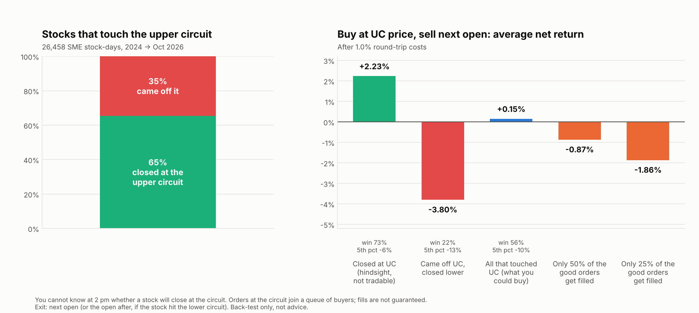

# SME upper-circuit: "buy the upper circuit, sell next day"

*Run on 9 Oct 2026. Code: [`sme_data.py`](../strategy_lab/sme_data.py), [`sme_uc_study.py`](../strategy_lab/sme_uc_study.py), [`sme_plots.py`](../strategy_lab/sme_plots.py). Data: NSE's own daily files for the SME series (SM and ST) and the per-stock price bands. Not investment advice.*

## 1. Bottom line

**It looks profitable in a back-test only because of hindsight, and it is very hard to execute. I would not run it.**



| Version | Average net return per trade (after 1.0% round-trip costs) |
|---|---|
| Stocks that **closed** at the upper circuit, bought at the circuit price, sold next open | **+1.6%**, 74% winners — *but you can't know at the time that a stock will close there* |
| Same, with a realistic exit when the stock flips to the lower circuit the next day | +1.2% |
| **Every stock that touched the upper circuit** (the only thing you could know when buying) | **+0.15%**, median +0.9%, 5th percentile -10% |
| Same, but only half of the "good" orders actually get filled | **-0.9%** |
| Executable chase: buy the next morning's open instead, sell that close | **-0.9%** (win rate 31–34%) |

## 2. What the data is

* **Source:** NSE daily files for series SM and ST, 1 Jan 2024 → 8 Oct 2026: 683 trading days, 636 stocks, 259,517 stock-days. The upper circuit for each stock-day is computed from its previous close and its exchange-published price band (5% for most, also 2%, 10%, 20%), rounded to the 5-paise tick.
* **Event:** the stock traded at the upper-circuit price. **17,314** stock-days closed at it, and with those that touched it and came off, there are **26,458** touches.
* **Costs:** 1.0% round trip assumed (delivery STT 0.1% each side, stamp, DP, brokerage, plus about 0.35% slippage per side); results at 0.5% and 2% are in `results/sme_uc_results.csv`.
* **Not covered:** intraday order books and queue positions (not in any free data), so fill probability is the big unknown.

## 3. The three traps

### Trap 1 — selecting winners with hindsight (look-ahead)
The tempting back-test picks days where the stock **closed** at the upper circuit. At 2 pm you don't know that. Of the stocks that touch the upper circuit, **35% come off it and close lower**; those average **-3.8%** the next morning (22% winners; 4,135 of them closed more than 2% below the circuit and averaged -6.7%, only 5% winners). Include them and the edge shrinks from +2.2% to **+0.15%**.

### Trap 2 — you usually can't buy at that price
At an upper circuit there are, by definition, no sellers; a buy order joins a queue. **39% of the closing events were locked all day** — no trade below the circuit at all — and those have the best next-day numbers (+1.8%), which are exactly the ones a retail order will almost never fill. The events you *can* fill (the stock traded below the circuit first) are the ones that look worse. If only half of the good cases fill, the blended result is **-0.9%**; at a quarter it is -1.9%.

### Trap 3 — you may not be able to sell
After an upper-circuit day, **8.1% of stocks close at the lower circuit the next day** (4.9% open there), where there are no buyers and your sell order is stuck in a queue. Average loss on those is large and the tail is severe: **5th percentile -5.9% to -10%, worst cases -50% or more** (some extreme values may be unadjusted splits or bonuses). My own pre-set limit was a lower-circuit share of 5% or less; it came in at 7% for the stocks that were fillable and 10% for locked ones, so that check **failed**.

## 4. What the profitable-looking number really is

For events that closed at the upper circuit, the entire gain is the **overnight gap**: 78% of these stocks gap up the next morning (median +2.7% before costs). Once the gap has happened there is nothing left: buying the next open and selling that close loses **0.9%** per trade on average (win rate about one in three). So the idea only works if you are in the stock **before** the gap, i.e. in the queue, and that is the part you cannot control.

## 5. Practical points specific to SME stocks

* **Size:** the median minimum lot is worth about **₹1.1–1.2 lakh**, and 75% of events are in stocks whose minimum lot is ₹2 lakh or less, so every position is at least one lot.
* **Series ST (trade-for-trade)** is 54% of the events: delivery-only trading with no intraday square-off. Whether you can sell the next morning (BTST, delivery timing) depends on your broker's rules, which I have not verified.
* **Manipulation and surveillance:** the SME segment has been the subject of SEBI enforcement over pump-and-dump schemes ([Zerodha Daily Brief](https://thedailybrief.zerodha.com/p/hidden-frauds-in-indias-sme-market) is one write-up; recent press reports describe an alleged scheme across 82 mostly-SME stocks, which I have not verified against SEBI's orders), and NSE has tightened SME rules ([NSE caps SME IPO opening prices](https://www.business-standard.com/markets/ipo/nse-imposes-cap-on-price-of-sme-debutants-amid-concerns-of-manipulation-124070400486_1.html)). A strategy that buys stocks in the middle of price spikes is exposed to being the exit liquidity for operators.
* **Liquidity:** on days when the stock traded below the circuit first, median next-day traded value is about 26 lots, but 10% of events trade less than 3 lots' worth, which can make exiting hard.

## 6. Limitations
1. No order-book or queue data, so fill probability is assumed, not measured.
2. Costs (1.0% round trip) and the "stuck" exit rule (sell at the open after the next, if the stock closes at the lower circuit) are assumptions.
3. 2.7 years, one market regime, and the SME segment changed during it; results for individual stocks are dominated by a few hundred small names.
4. A few extreme returns may come from unadjusted corporate actions (splits/bonuses) in NSE's raw prices; the median and the 5th percentile are more reliable than the worst case.
5. Intervals are narrow because the sample is large (17,314 events), but events on the same day are correlated and the fill problem dominates any statistical uncertainty.

## 7. Verdict
* **Do not buy upper-circuit SME stocks hoping to sell next day.** With information you actually have, the average edge after costs is about zero, it turns negative as soon as fills are less than certain, and one trade in 12 can leave you stuck holding a falling stock.
* **If you still want to explore it,** the only version worth studying uses real-time data (order book depth and queue size at the circuit) to estimate whether a lock is "strong" — and it needs tick or depth data from a broker or vendor, which I don't have.

## 8. Reproduce
```
python -m strategy_lab.sme_data 2024-01-01   # downloads NSE daily SME data (~15 min first run, cached)
python -m strategy_lab.sme_uc_study          # events, scenarios, pre-registered checks
python -m strategy_lab.sme_plots             # chart
```
Results: `strategy_lab/results/sme_uc_results.csv`, `sme_uc_events.csv`, `sme_touch_uc.csv`.
